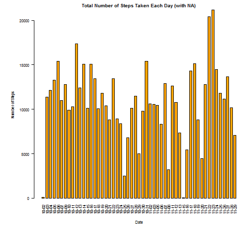
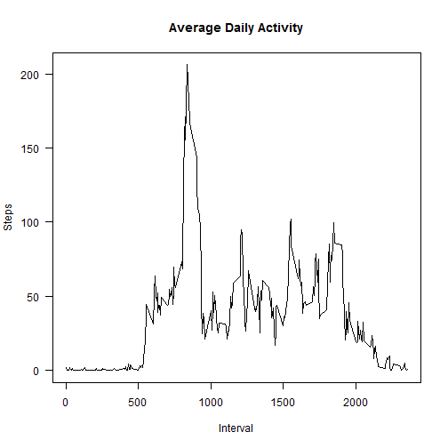
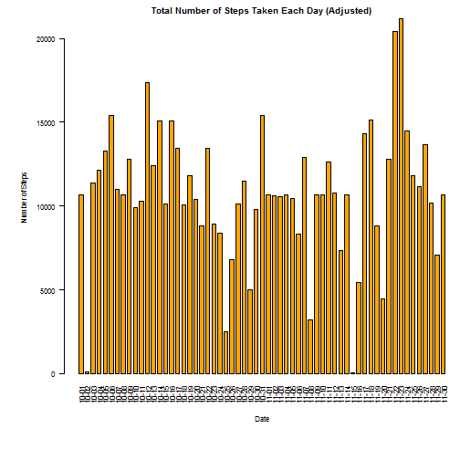
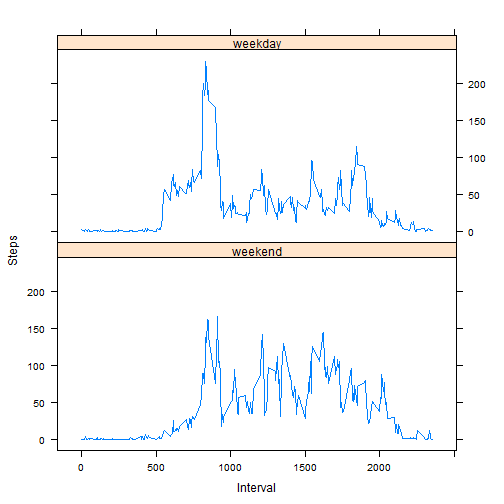

Peer Assessment #1
==================

This is the first peer assessment for **Reproducible Research**, the fifth class in 
[Coursera and Johns Hopkins Bloomberg School of Public Health's Data Science Specialization][1]
series.


Introduction
------------

It is now possible to collect a large amount of data about personal movement using activity
monitoring devices such as a [Fitbit][2], [Nike Fuelband][3], or [Jawbone Up][4]. These type of
devices are part of the "quantified self" movement - a group of enthusiasts who take measurements
about themselves regularly to improve their health, to find patterns in their behavior, or because
they are tech geeks. But these data remain under-utilized both because the raw data are hard to
obtain and there is a lack of statistical methods and software for processing and interpreting the
data.

This assignment makes use of data from a personal activity monitoring device. This device collects
data at 5 minute intervals through out the day. The data consists of two months of data from an
anonymous individual collected during the months of October and November, 2012 and include the
number of steps taken in 5 minute intervals each day.


Data
----

The data for this assignment can be downloaded from the course web site:  
**Dataset**: [Activity monitoring data][5] [52K]

The variables included in this dataset are:  
+ **steps**: Number of steps taking in a 5-minute interval (missing values are coded as `NA`)  
+ **date**: The date on which the measurement was taken in YYYY-MM-DD format  
+ **interval**: Identifier for the 5-minute interval in which measurement was taken

The dataset is stored in a comma-separated-value (CSV) file and there are a total of 17,568
observations in this dataset.


Loading and Preprocessing the Data
----------------------------------

Load the data.


```r
fileURL <- "http://d396qusza40orc.cloudfront.net/repdata%2Fdata%2Factivity.zip"
download.file(fileURL, destfile = "./repdata-PA1/activity.zip", method = "auto")
zipfile <- "./activity.zip"
unzip(zipfile, exdir = "./repdata-PA1")

data <- read.csv("./activity.csv")
summary(data)
```

```
##      steps                date          interval     
##  Min.   :  0.00   2012-10-01:  288   Min.   :   0.0  
##  1st Qu.:  0.00   2012-10-02:  288   1st Qu.: 588.8  
##  Median :  0.00   2012-10-03:  288   Median :1177.5  
##  Mean   : 37.38   2012-10-04:  288   Mean   :1177.5  
##  3rd Qu.: 12.00   2012-10-05:  288   3rd Qu.:1766.2  
##  Max.   :806.00   2012-10-06:  288   Max.   :2355.0  
##  NA's   :2304     (Other)   :15840
```

Process the data.


```r
steps <- data$steps
date  <- data$date
date  <- gsub("2012-", "", date)  # remove the year from each date
invls <- data$interval 
```


Average Number of Steps Taken per Day
-------------------------------------

Calculate the total number of steps taken per day (ignoring the missing values). Notice under `date`
we have `Length:53`. This means there were only 53 days with valid observations.


```r
steps.tot <- aggregate(steps ~ date, FUN = sum)
summary(steps.tot)
```

```
##      date               steps      
##  Length:53          Min.   :   41  
##  Class :character   1st Qu.: 8841  
##  Mode  :character   Median :10765  
##                     Mean   :10766  
##                     3rd Qu.:13294  
##                     Max.   :21194
```

Create a graph of the total number of steps taken each day.


```r
with(steps.tot, {
        par(cex = 0.7, las = 2, oma = c(2, 0, 0, 0), mgp = c(4, 1, 0), mar = c(7, 7, 2, 0))
        barplot(height = steps, main = "Total Number of Steps Taken Each Day (with NA)",
                xlab = "Date", names.arg = date, font = 1,
                ylab = "Number of Steps", col = "orange", space = 0.5)
})
```

 

Calculate the **mean** and **median** of the total number of steps taken per day.


```r
floor(mean(steps.tot$steps))
```

```
## [1] 10766
```

```r
floor(median(steps.tot$steps))
```

```
## [1] 10765
```


Average Daily Activity Pattern
------------------------------

Make a time series plot of the 5-minute interval (x-axis) and the average number of steps taken
(y-axis), averaged across all days.


```r
daily.avg <- aggregate(steps ~ invls, FUN = mean)
with(daily.avg, {
        par(cex = 0.7, las = 2, oma = c(2, 0, 0, 0), mgp = c(4, 1, 0), mar = c(7, 7, 2, 0))
        plot(daily.avg, type = "l", main = "Average Daily Activity",
             xlab = "Interval", ylab = "Steps")
})
```

 

Which 5-minute interval, on average across all days in the dataset, contains the maximum number of
steps?


```r
daily.avg[daily.avg$steps == (max(daily.avg$steps)), ]
```

```
##     invls    steps
## 104   835 206.1698
```

**Answer**: The 835th interval, which is just before 2pm.

Imputing Missing Values
-----------------------

Calculate the total number of missing values in the dataset.


```r
sum(is.na(data))
```

```
## [1] 2304
```

Fill in missing values with the mean for the corresponding 5-minute interval.


```r
steps.imp <- data.frame(steps)
steps.imp[is.na(steps.imp), ] <- floor(tapply(steps, invls, mean, na.rm = TRUE))
```

Create an updated dataset, with the missing values now filled in (notice there is no longer a count
for `NA`).


```r
updata <- cbind(steps.imp, data[, 2:3])
summary(updata)
```

```
##      steps                date          interval     
##  Min.   :  0.00   2012-10-01:  288   Min.   :   0.0  
##  1st Qu.:  0.00   2012-10-02:  288   1st Qu.: 588.8  
##  Median :  0.00   2012-10-03:  288   Median :1177.5  
##  Mean   : 37.33   2012-10-04:  288   Mean   :1177.5  
##  3rd Qu.: 27.00   2012-10-05:  288   3rd Qu.:1766.2  
##  Max.   :806.00   2012-10-06:  288   Max.   :2355.0  
##                   (Other)   :15840
```

Process the updated dataset.


```r
ustep <- updata$steps
udate <- updata$date
udate <- gsub("2012-", "", udate)  # remove the year from each date
uinvl <- updata$interval 
```

Graph the new dataset.


```r
daily.adj <- aggregate(ustep ~ udate, FUN = sum)
with(daily.adj, {
        par(cex = 0.7, las = 2, oma = c(2, 0, 0, 0), mgp = c(4, 1, 0), mar = c(7, 7, 2, 0))
        barplot(height = ustep, main = "Total Number of Steps Taken Each Day (Adjusted)",
                xlab = "Date", names.arg = udate, font = 1,
                ylab = "Number of Steps", col = "orange", space = 0.5)
})
```

 

Calculate the **mean** and **median** total number of steps taken per day. Notice under `date` we
have `Length:61`. Becaused we imputed the missing values, all 61 days have valid observations.


```r
steps.adj <- aggregate(ustep ~ udate, FUN = sum)
summary(steps.adj)
```

```
##     udate               ustep      
##  Length:61          Min.   :   41  
##  Class :character   1st Qu.: 9819  
##  Mode  :character   Median :10641  
##                     Mean   :10750  
##                     3rd Qu.:12811  
##                     Max.   :21194
```

```r
floor(mean(steps.adj$ustep))
```

```
## [1] 10749
```

```r
floor(median(steps.adj$ustep))
```

```
## [1] 10641
```

By imputing missing values on the estimates of the total daily number of steps, **the mean and**
**median have both decreased**. This is due to the fact that now there are more observations and,
thus, more days -- dividing some amount by a larger number of days (61) versus the original number
of days (53) results in a smaller number.


Differences in Activity Patterns, Weekdays vs. Weekends
-------------------------------------------------------

Create a new factor variable in the dataset with two levels -- `"weekday"` and `"weekend"` -- 
indicating whether a given date is a weekday or a weekend day.


```r
daytype <- as.Date(data$date)
dayname <- c("Mon", "Tue", "Wed", "Thu", "Fri")

whatday <- factor((weekdays(daytype, abbreviate = TRUE) %in% dayname),
                  labels = c("weekend", "weekday"))

wkdata <- cbind(updata[1:2], whatday, updata[3])
summary(wkdata)
head(wkdata, 10)
```

Create a panel plot of the 5-minute interval (x-axis) and the average number of steps taken (y-axis)
averaged across all weekdays versus all weekend days using **{lattice}**. Use `install.packages()`
if necessary.


```r
wstep.total <- aggregate(ustep ~ whatday + uinvl, FUN = mean)
head(wstep.total, 12)
```

```
##    whatday uinvl      ustep
## 1  weekend     0 0.12500000
## 2  weekday     0 2.15555556
## 3  weekend     5 0.00000000
## 4  weekday     5 0.40000000
## 5  weekend    10 0.00000000
## 6  weekday    10 0.15555556
## 7  weekend    15 0.00000000
## 8  weekday    15 0.17777778
## 9  weekend    20 0.00000000
## 10 weekday    20 0.08888889
## 11 weekend    25 3.50000000
## 12 weekday    25 1.57777778
```

```r
library(lattice)

xyplot(ustep ~ uinvl | whatday, data = wstep.total, layout = c(1, 2), type = "l",
       xlab = "Interval", ylab = "Steps")
```

 


Credits
-------


```
## [1] "Maria Celestina Morales"  "Coursera | repdata-014"  
## [3] "Sun May 17 05:45:50 2015"
```

[1]: https://www.coursera.org/specialization/jhudatascience/1
[2]: http://www.fitbit.com/
[3]: http://www.nike.com/us/en_us/c/nikeplus-fuelband
[4]: https://jawbone.com/up
[5]: https://d396qusza40orc.cloudfront.net/repdata%2Fdata%2Factivity.zip
