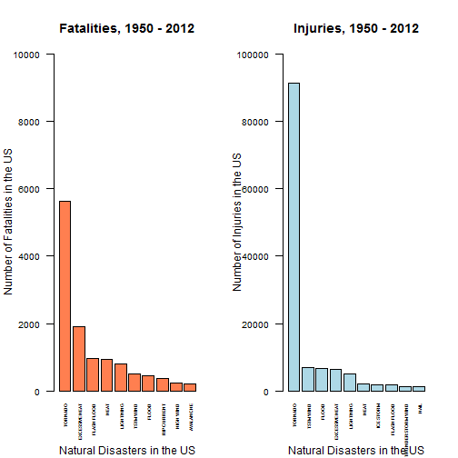
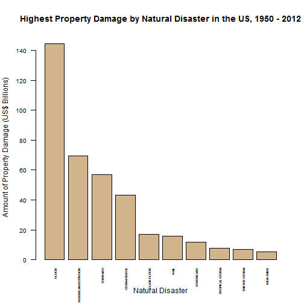
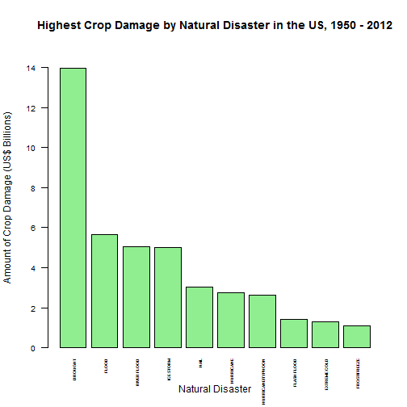

Impact of Natural Disasters on US Population and Economy, 1950-2012
===================================================================

**Author**: Maria Celestina Morales -- http://rpubs.com/mcvmorales/repdata-pa2  
**Date**: May 2015

```
## R version 3.1.3 (2015-03-09)
## Platform: x86_64-w64-mingw32/x64 (64-bit)
## Running under: Windows 8 x64 (build 9200)
## 
## locale:
## [1] LC_COLLATE=English_United States.1252 
## [2] LC_CTYPE=English_United States.1252   
## [3] LC_MONETARY=English_United States.1252
## [4] LC_NUMERIC=C                          
## [5] LC_TIME=English_United States.1252    
## 
## attached base packages:
## [1] stats     graphics  grDevices utils     datasets  methods   base     
## 
## other attached packages:
## [1] knitr_1.10
## 
## loaded via a namespace (and not attached):
## [1] digest_0.6.8    evaluate_0.6    formatR_1.2     htmltools_0.2.6
## [5] rmarkdown_0.5.1 stringr_0.6.2   tools_3.1.3
```


Synopsis
--------

This project involves exploring the **U.S. National Oceanic and Atmospheric Administration**'s
(NOAA) storm database. This database tracks characteristics of major storms and weather events in
the United States, including when and where they occur, as well as estimates of any fatalities,
injuries, and property damage.

Storms and other severe weather events can cause both public health and economic problems for
communities and municipalities. Many severe events can result in fatalities, injuries, and property
damage, and preventing such outcomes to the extent possible is a key concern.

We want to answer the following two questions:

 1. Across the United States, which types of events (as indicated in the `EVTYPE` variable) are most
    harmful with respect to population health?
 2. Across the United States, which types of events have the greatest economic consequences?

This is the second peer assessment for **Reproducible Research**, the fifth class in 
[Coursera and Johns Hopkins Bloomberg School of Public Health's Data Science Specialization][1]
series.


About the Data 
--------------

The data for this assignment come in the form of a comma-separated-value file compressed via the
*bzip2* algorithm to reduce its size. The file can be downloaded from the course web site:  
[Storm Data][2] [47Mb]

There is also some documentation of the database available. Here is some information on how some of
the variables are constructed/defined:  
**National Weather Service**: [Storm Data Documentation][3]  
**National Climatic Data Center**: [Storm Events FAQ][4]

The events in the database start in the year 1950 and end in November 2011. In the earlier years of
the database there are generally fewer events recorded, most likely due to a lack of good records.
More recent years should be considered more complete.


Loading and Processing the Data
-------------------------------

Read the data.


```r
if(!file.exists("./noaa")) { dir.create("./noaa") }

fileURL <- "http://d396qusza40orc.cloudfront.net/repdata%2Fdata%2FStormData.csv.bz2"
download.file(fileURL, "./noaa/storm.bz2")

stormdata <- read.csv("./noaa/storm.bz2")
str(stormdata)
```

```
## 'data.frame':	902297 obs. of  37 variables:
##  $ STATE__   : num  1 1 1 1 1 1 1 1 1 1 ...
##  $ BGN_DATE  : Factor w/ 16335 levels "1/1/1966 0:00:00",..: 6523 6523 4242 11116 2224 2224 2260 383 3980 3980 ...
##  $ BGN_TIME  : Factor w/ 3608 levels "00:00:00 AM",..: 272 287 2705 1683 2584 3186 242 1683 3186 3186 ...
##  $ TIME_ZONE : Factor w/ 22 levels "ADT","AKS","AST",..: 7 7 7 7 7 7 7 7 7 7 ...
##  $ COUNTY    : num  97 3 57 89 43 77 9 123 125 57 ...
##  $ COUNTYNAME: Factor w/ 29601 levels "","5NM E OF MACKINAC BRIDGE TO PRESQUE ISLE LT MI",..: 13513 1873 4598 10592 4372 10094 1973 23873 24418 4598 ...
##  $ STATE     : Factor w/ 72 levels "AK","AL","AM",..: 2 2 2 2 2 2 2 2 2 2 ...
##  $ EVTYPE    : Factor w/ 985 levels "   HIGH SURF ADVISORY",..: 834 834 834 834 834 834 834 834 834 834 ...
##  $ BGN_RANGE : num  0 0 0 0 0 0 0 0 0 0 ...
##  $ BGN_AZI   : Factor w/ 35 levels "","  N"," NW",..: 1 1 1 1 1 1 1 1 1 1 ...
##  $ BGN_LOCATI: Factor w/ 54429 levels "","- 1 N Albion",..: 1 1 1 1 1 1 1 1 1 1 ...
##  $ END_DATE  : Factor w/ 6663 levels "","1/1/1993 0:00:00",..: 1 1 1 1 1 1 1 1 1 1 ...
##  $ END_TIME  : Factor w/ 3647 levels ""," 0900CST",..: 1 1 1 1 1 1 1 1 1 1 ...
##  $ COUNTY_END: num  0 0 0 0 0 0 0 0 0 0 ...
##  $ COUNTYENDN: logi  NA NA NA NA NA NA ...
##  $ END_RANGE : num  0 0 0 0 0 0 0 0 0 0 ...
##  $ END_AZI   : Factor w/ 24 levels "","E","ENE","ESE",..: 1 1 1 1 1 1 1 1 1 1 ...
##  $ END_LOCATI: Factor w/ 34506 levels "","- .5 NNW",..: 1 1 1 1 1 1 1 1 1 1 ...
##  $ LENGTH    : num  14 2 0.1 0 0 1.5 1.5 0 3.3 2.3 ...
##  $ WIDTH     : num  100 150 123 100 150 177 33 33 100 100 ...
##  $ F         : int  3 2 2 2 2 2 2 1 3 3 ...
##  $ MAG       : num  0 0 0 0 0 0 0 0 0 0 ...
##  $ FATALITIES: num  0 0 0 0 0 0 0 0 1 0 ...
##  $ INJURIES  : num  15 0 2 2 2 6 1 0 14 0 ...
##  $ PROPDMG   : num  25 2.5 25 2.5 2.5 2.5 2.5 2.5 25 25 ...
##  $ PROPDMGEXP: Factor w/ 19 levels "","-","?","+",..: 17 17 17 17 17 17 17 17 17 17 ...
##  $ CROPDMG   : num  0 0 0 0 0 0 0 0 0 0 ...
##  $ CROPDMGEXP: Factor w/ 9 levels "","?","0","2",..: 1 1 1 1 1 1 1 1 1 1 ...
##  $ WFO       : Factor w/ 542 levels ""," CI","$AC",..: 1 1 1 1 1 1 1 1 1 1 ...
##  $ STATEOFFIC: Factor w/ 250 levels "","ALABAMA, Central",..: 1 1 1 1 1 1 1 1 1 1 ...
##  $ ZONENAMES : Factor w/ 25112 levels "","                                                                                                                               "| __truncated__,..: 1 1 1 1 1 1 1 1 1 1 ...
##  $ LATITUDE  : num  3040 3042 3340 3458 3412 ...
##  $ LONGITUDE : num  8812 8755 8742 8626 8642 ...
##  $ LATITUDE_E: num  3051 0 0 0 0 ...
##  $ LONGITUDE_: num  8806 0 0 0 0 ...
##  $ REMARKS   : Factor w/ 436781 levels "","-2 at Deer Park\n",..: 1 1 1 1 1 1 1 1 1 1 ...
##  $ REFNUM    : num  1 2 3 4 5 6 7 8 9 10 ...
```

The variables that are relevant to our analysis are:

 * `EVTYPE`: the type of event, or natural disaster  
 * `FATALITIES`: the number of fatalities  
 * `INJURIES`: the number of injuries  
 * `PROPDMG`: amount of property damage by magnitude, in US$  
 * `PROPDMGEXP`: order of magnitude for property damage  
 * `CROPDMG`: amount of crop damage by magnitude, in US$  
 * `CROPDMGEXP`: order of magnitude for crop damage  

Subset the data so that we can better focus on these variables.


```r
columns <- c("EVTYPE", "FATALITIES", "INJURIES", "PROPDMG", "PROPDMGEXP", "CROPDMG", "CROPDMGEXP")
newdata <- stormdata[columns]
str(newdata)
```

```
## 'data.frame':	902297 obs. of  7 variables:
##  $ EVTYPE    : Factor w/ 985 levels "   HIGH SURF ADVISORY",..: 834 834 834 834 834 834 834 834 834 834 ...
##  $ FATALITIES: num  0 0 0 0 0 0 0 0 1 0 ...
##  $ INJURIES  : num  15 0 2 2 2 6 1 0 14 0 ...
##  $ PROPDMG   : num  25 2.5 25 2.5 2.5 2.5 2.5 2.5 25 25 ...
##  $ PROPDMGEXP: Factor w/ 19 levels "","-","?","+",..: 17 17 17 17 17 17 17 17 17 17 ...
##  $ CROPDMG   : num  0 0 0 0 0 0 0 0 0 0 ...
##  $ CROPDMGEXP: Factor w/ 9 levels "","?","0","2",..: 1 1 1 1 1 1 1 1 1 1 ...
```

Notice that `PROPDMGEXP` and `CROPDMGEXP` are factors containing multiple numbers, letters, and
symbols.

According to the [Storm Data Documentation][3], "estimates should be rounded to three significant
digits, followed by an alphabetical character signifying the magnitude of the number, i.e., 1.55B 
for $1,550,000,000. Alphabetical characters used to signify magnitude include `K` for thousands,
`M` for millions, and `B` for billions."

**Note**:  Some integer 'n' means the damage should be multiplied by a magnitude of 10^n, or `1e+n`.

Meanwhile, `-`, `?`, and `+` do not appear to have any meaning. Observations with those symbols will
be assigned a magnitude of 0. Such instances can be checked using the following code: 


```r
PROPDMGEXP.sym <- subset(newdata, (newdata$PROPDMGEXP == "-" | newdata$PROPDMGEXP == "?" |
                                   newdata$PROPDMGEXP == "+"))
CROPDMGEXP.sym <- subset(newdata, (newdata$CROPDMGEXP == "?"))
```

Add a new column `PDM` (Property Damage Magnitude) that contains the proper multiplier based on the
code in `PROPDMGEXP`.
 

```r
unique(newdata$PROPDMGEXP)
```

```
##  [1] K M   B m + 0 5 6 ? 4 2 3 h 7 H - 1 8
## Levels:  - ? + 0 1 2 3 4 5 6 7 8 B h H K m M
```

```r
newdata$PDM[newdata$PROPDMGEXP == "-" | newdata$PROPDMGEXP == "?" | newdata$PROPDMGEXP == "+"] = 0

newdata$PDM[newdata$PROPDMGEXP == 0] = 1e+00
newdata$PDM[newdata$PROPDMGEXP == 1] = 1e+01
newdata$PDM[newdata$PROPDMGEXP == 2] = 1e+02
newdata$PDM[newdata$PROPDMGEXP == 3] = 1e+03
newdata$PDM[newdata$PROPDMGEXP == 4] = 1e+04
newdata$PDM[newdata$PROPDMGEXP == 5] = 1e+05
newdata$PDM[newdata$PROPDMGEXP == 6] = 1e+06
newdata$PDM[newdata$PROPDMGEXP == 7] = 1e+07
newdata$PDM[newdata$PROPDMGEXP == 8] = 1e+08

newdata$PDM[newdata$PROPDMGEXP == "H" | newdata$PROPDMGEXP == "h"] = 100
newdata$PDM[newdata$PROPDMGEXP == "K" | newdata$PROPDMGEXP == "k"] = 1000
newdata$PDM[newdata$PROPDMGEXP == "M" | newdata$PROPDMGEXP == "m"] = 1000000
newdata$PDM[newdata$PROPDMGEXP == "B" | newdata$PROPDMGEXP == "b"] = 1000000000
```

Likewise, create `CDM` (Crop Damage Magnitude) from `CROPDMGEXP`.


```r
unique(newdata$CROPDMGEXP)
```

```
## [1]   M K m B ? 0 k 2
## Levels:  ? 0 2 B k K m M
```

```r
newdata$CDM[newdata$CROPDMGEXP == "?"] = 0

newdata$CDM[newdata$CROPDMGEXP == 0] = 1e+00
newdata$CDM[newdata$CROPDMGEXP == 2] = 1e+02

newdata$CDM[newdata$CROPDMGEXP == "K" | newdata$CROPDMGEXP == "k"] = 1000
newdata$CDM[newdata$CROPDMGEXP == "M" | newdata$CROPDMGEXP == "m"] = 1000000
newdata$CDM[newdata$CROPDMGEXP == "B" | newdata$CROPDMGEXP == "b"] = 1000000000
```

Now that we have the proper multipliers for each observation, we can compute the property damage
and crop damage accordingly, saving the values in `PROPDMG` and `CROPDMG`.


```r
newdata$PROPDMG <- newdata$PROPDMG * newdata$PDM
newdata$CROPDMG <- newdata$CROPDMG * newdata$CDM
```

Now that the data is more clean, we can get rid of `PROPDMGEXP` and `CROPDMGEXP`. Assign the
cleaned data to the data frame, `damages`.


```r
damages <- newdata[1:4]
damages <- cbind(damages, newdata[6])
```

Observe these variables by `EVTYPE`, the type of event or natural disaster. According to the
[Storm Data Documentation][3], there are forty-eight (48) specified types of natural events.

Aggregate the data to prepare for plotting.


```r
fatalities <- aggregate(FATALITIES ~ EVTYPE, damages, sum)
injuries   <- aggregate(INJURIES   ~ EVTYPE, damages, sum)
propdmg    <- aggregate(PROPDMG ~ EVTYPE, damages, sum)
cropdmg    <- aggregate(CROPDMG ~ EVTYPE, damages, sum)
```

We want to focus on the the worst ten (10) natural disasters, by fatalities, injuries, property
damage, and crop damage.


```r
fatal10 <- fatalities[order(-fatalities$FATALITIES), ][1:10, ]
injur10 <- injuries[order(-injuries$INJURIES), ][1:10, ]
prdmg10 <- propdmg[order(-propdmg$PROPDMG), ][1:10, ]
crdmg10 <- cropdmg[order(-cropdmg$CROPDMG), ][1:10, ]
```


Results
-------

### Question 1
Across the United States, which types of events (as indicated in the `EVTYPE` variable) are most
harmful with respect to population health?
    

```r
par(mfrow = c(1, 2))
options(scipen = 999)
barplot(fatal10$FATALITIES, main = "Fatalities, 1950 - 2012",
        sub = "Natural Disasters in the US", names.arg = fatal10$EVTYPE, col = "coral",
        xlab = " ", ylab = "Number of Fatalities in the US",
        ylim = c(0, 10000), las = 2, cex.axis = .8, cex.names = .4)
barplot(injur10$INJURIES, main = "Injuries, 1950 - 2012",
        sub = "Natural Disasters in the US", names.arg = injur10$EVTYPE, col = "lightblue",
        xlab = " ", ylab = "Number of Injuries in the US",
        ylim = c(0, 100000), las = 2, cex.axis = .8, cex.names = .4)
```

 

Look at the top three in both categories:


```r
q1 <- cbind(head(fatal10, 3), head(injur10, 3))
q1
```

```
##             EVTYPE FATALITIES    EVTYPE INJURIES
## 834        TORNADO       5633   TORNADO    91346
## 130 EXCESSIVE HEAT       1903 TSTM WIND     6957
## 153    FLASH FLOOD        978     FLOOD     6789
```

From 1950 to 2012, **tornadoes** have **killed** the most Americans (5,633 fatalities);
they are followed by **excessive heat** (1,903 fatalities) and **flashfloods** (978 fatalities).
**Tornadoes** have also **injured** the most Americans (91,346 injuries), followed by
**thunderstorm winds** (9,657 injuries) and **floods** (6,789 injuries).

Combined, **tornadoes are the most harmful to the US populace**.


### Question 2
Across the United States, which types of events have the greatest economic consequences?


```r
par(mfrow = c(1,1))
barplot(prdmg10$PROPDMG / 1e+09,
        main = "Highest Property Damage by Natural Disaster in the US, 1950 - 2012",
        names.arg = prdmg10$EVTYPE, col = "tan",
        xlab = "Natural Disaster", ylab = "Amount of Property Damage (US$ Billions)",
        ylim = c(0, 150), las = 2, cex.axis = .8, cex.names = .4)
```

 

```r
barplot(crdmg10$CROPDMG / 1e+09,
        main = "Highest Crop Damage by Natural Disaster in the US, 1950 - 2012",
        names.arg = crdmg10$EVTYPE, col = "lightgreen",
        xlab = "Natural Disaster", ylab = "Amount of Crop Damage (US$ Billions)",
        ylim = c(0, 15), las = 2, cex.axis = .8, cex.names = .4)
```

 

Look at the top three in both categories:


```r
q2 <- cbind(head(prdmg10, 3), head(crdmg10, 3))
q2
```

```
##                EVTYPE      PROPDMG      EVTYPE     CROPDMG
## 63              FLOOD 144657709800     DROUGHT 13972566000
## 181 HURRICANE/TYPHOON  69305840000       FLOOD  5661968450
## 335           TORNADO  56947380614 RIVER FLOOD  5029459000
```

From 1950 to 2012, **floods** have caused the **most property damage** at $144.6 billion,
followed by **hurricanes/typhoons** at $69.3 billion, and **tornadoes** at $56.9 billion in damages.
Meanwhile, **droughts** have caused the **most crop damage** at $14 billion, followed by **floods**
at $5.6 billion and **river floods** at $5 billion in damages.

[1]: https://www.coursera.org/specialization/jhudatascience/1
[2]: https://d396qusza40orc.cloudfront.net/repdata%2Fdata%2FStormData.csv.bz2
[3]: https://d396qusza40orc.cloudfront.net/repdata%2Fpeer2_doc%2Fpd01016005curr.pdf
[4]: https://d396qusza40orc.cloudfront.net/repdata%2Fpeer2_doc%2FNCDC%20Storm%20Events-FAQ%20Page.pdf


```
## [1] "Fri May 22 23:37:06 2015"
```
